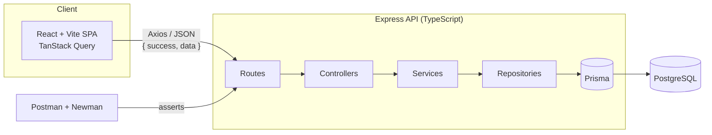

# REST API Testing Suite

[](https://github.com/devtejasx/real-time-chat-app/actions/workflows/api-tests.yml)


A full-stack, production-quality SaaS dashboard for managing and monitoring
automated REST API testing — with a live backend, PostgreSQL, a Postman/Newman
test suite and CI. The UI is inspired by Vercel, GitHub, Postman and Railway.

- **Frontend** — React 19 · TypeScript · Vite · Tailwind · shadcn/ui · TanStack Query · Recharts · Framer Motion
- **Backend** — Node.js · Express · TypeScript · PostgreSQL · Prisma · JWT · Zod · Winston · Swagger
- **Quality** — Postman collection + Newman (CLI/HTML/JUnit) + GitHub Actions
- **Ops** — Docker + docker-compose (Postgres + backend + frontend)

---

## Project Overview

The dashboard manages Postman-style API collections, runs test executions,
records reports, and surfaces Docker + GitHub Actions status. The frontend
consumes the backend's REST API through a typed service + mapper layer, so the
UI renders **live data from PostgreSQL** — with loading, error and empty states
throughout.

## Architecture



Request flow: **HTTP → middleware (helmet, cors, rate-limit, logger, validate,
auth) → routes → thin controllers → services (business logic) → repositories
(Prisma) → PostgreSQL**. A global error handler normalizes every failure into
`{ success:false, message, errors }`.

## Folder Structure

```
real-time-chat-app/
├── src/                       # Frontend (React)
│   ├── components/            # ui/ (shadcn), common/, charts/, layout/
│   ├── pages/                 # one file per route
│   ├── hooks/                 # TanStack Query hooks
│   ├── services/              # axios client, api.types, mappers, *.service
│   ├── layouts/  routes/  types/  utils/
├── backend/                   # Backend (Express + Prisma)
│   ├── src/
│   │   ├── config/ controllers/ middleware/ routes/
│   │   ├── services/ repositories/ validators/
│   │   ├── utils/ types/ prisma/ seed/
│   │   ├── app.ts  server.ts
│   ├── prisma/                # schema.prisma, migrations/, seed.ts
│   ├── Dockerfile  docker-compose.yml  docker-entrypoint.sh
├── postman/                   # Postman collection + environment
├── reports/                   # Newman CLI/HTML/JUnit output
├── .github/workflows/         # api-tests.yml (CI)
├── Dockerfile                 # Frontend image (nginx)
├── docker-compose.yml         # Root: db + backend + frontend
└── INTEGRATION.md
```

## Tech Stack

| Layer     | Technologies                                                                 |
| --------- | ---------------------------------------------------------------------------- |
| Frontend  | React 19, TypeScript, Vite, Tailwind, shadcn/ui, React Router, TanStack Query, Axios, Recharts, Framer Motion |
| Backend   | Node.js, Express, TypeScript, PostgreSQL, Prisma, JWT, bcryptjs, Zod, Winston, Helmet, CORS, Morgan, Swagger |
| Testing   | Postman, Newman (htmlextra + JUnit reporters)                                |
| DevOps    | Docker, docker-compose, GitHub Actions                                       |

## Installation

```bash
git clone https://github.com/devtejasx/real-time-chat-app.git
cd real-time-chat-app

# Frontend deps (also provides Newman)
npm install

# Backend deps
cd backend && npm install && npm run prisma:generate && cd ..
```

## Environment Variables

**Frontend** (`.env`, see `.env.example`):

| Variable            | Description                | Default                   |
| ------------------- | -------------------------- | ------------------------- |
| `VITE_API_BASE_URL` | Backend API base URL       | `http://localhost:8080/api` |

The API URL can also be changed at runtime from the **Settings** page.

**Backend** (`backend/.env`, see `backend/.env.example`): `PORT`, `CORS_ORIGIN`,
`DATABASE_URL`, `JWT_SECRET`, `JWT_EXPIRES_IN`, `BCRYPT_SALT_ROUNDS`,
`RATE_LIMIT_*`, `SEED_ADMIN_EMAIL`, `SEED_ADMIN_PASSWORD`.

## Docker Setup (one command)

Starts PostgreSQL, the backend (migrations + seed run automatically), and the
frontend:

```bash
docker compose up --build
# frontend → http://localhost:3000
# backend  → http://localhost:8080/api
# docs     → http://localhost:8080/api/docs
```

Postgres data persists in the `pgdata` volume; the backend waits for the DB
health check before starting.

## Database Migration

```bash
cd backend
npm run prisma:migrate     # create/apply a dev migration
npm run prisma:deploy      # apply committed migrations (CI/prod)
npm run prisma:studio      # browse data
```

An initial migration is committed at `backend/prisma/migrations/`.

## Seed Command

```bash
cd backend
npm run seed
```

Inserts **1 admin user, 5 collections, 20 executions, 100 request results, 20
reports**. Admin login: `admin@rats.dev` / `Admin@12345`.

## Running Locally (without Docker)

Requires a local PostgreSQL matching `backend/.env` `DATABASE_URL`.

```bash
# Terminal 1 — backend
cd backend
npm run prisma:deploy && npm run seed
npm run dev                # http://localhost:8080

# Terminal 2 — frontend
npm run dev                # http://localhost:5173
```

## API Documentation

Interactive Swagger UI is served at **`http://localhost:8080/api/docs`** and
documents every endpoint. Key routes (base `…/api`, also mounted at `…/api/v1`):

| Method | Endpoint             | Auth | Purpose                    |
| ------ | -------------------- | ---- | -------------------------- |
| POST   | `/auth/register`     | —    | Create account (JWT)       |
| POST   | `/auth/login`        | —    | Log in (JWT)               |
| GET    | `/dashboard`         | —    | Aggregated metrics + charts|
| GET    | `/collections`       | —    | List (search/paginate)     |
| GET/POST/PUT/DELETE | `/collections/:id` | writes: ✅ | CRUD          |
| POST   | `/executions/run`    | ✅   | Run a collection           |
| GET    | `/executions[/:id]`  | —    | Execution history          |
| GET    | `/reports[/:id]`     | —    | Reports + details          |
| GET    | `/docker`, `/github` | —    | Infra status (mocked)      |

## Running Newman

Start the backend (e.g. `docker compose up`), then:

```bash
npm run test:api        # CLI + HTML + JUnit reports → reports/
npm run test:api:cli    # CLI only
```

Reports are written to `reports/newman-report.html` and `reports/newman-report.xml`.

## Running GitHub Actions

The workflow at `.github/workflows/api-tests.yml` runs on every `push` and
`pull_request`: it boots the stack with docker-compose, waits for the backend,
runs Newman, uploads reports as artifacts, and fails if any assertion fails.

Run it locally with [`act`](https://github.com/nektos/act):

```bash
act -j api-tests            # requires Docker + act
```

## Deployment

- **Backend + DB** — deploy `backend/` via its Dockerfile to any container host
  (Railway, Render, Fly.io, ECS). Provide `DATABASE_URL`, `JWT_SECRET`,
  `CORS_ORIGIN`; the entrypoint applies migrations and seeds on boot.
- **Frontend** — the root Dockerfile builds a static nginx image; or deploy
  `dist/` to any static host (Vercel/Netlify). Set `VITE_API_BASE_URL` to the
  deployed backend.

## Future Improvements

- WebSocket/SSE stream for live execution progress from the real runner.
- Real Docker Engine (`dockerode`) and GitHub REST integrations.
- Refresh tokens + role-based admin UI and a frontend login screen.
- Jest + Supertest unit/integration tests alongside the Newman suite.
- Server-side pagination/sorting wired to the collections list.
