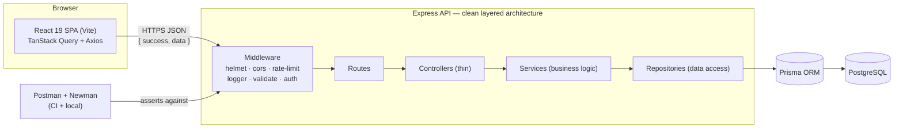

# Architecture

The REST API Testing Suite is a full-stack monorepo: a React SPA talking to an
Express REST API backed by PostgreSQL, with a Postman/Newman test suite and a
GitHub Actions pipeline. Everything runs together via Docker Compose.

## High-level diagram



## Request lifecycle

1. **Middleware** — Helmet sets security headers, CORS allows the SPA origins,
   the rate limiter throttles abuse, Morgan+Winston log the request, Zod
   validates `body`/`params`/`query`, and the JWT guard protects writes.
2. **Routes** map a URL + method to a controller.
3. **Controllers** stay thin: parse the request, call one service, send the
   `{ success, data }` envelope. No business logic lives here.
4. **Services** own all business logic and throw typed `ApiError`s.
5. **Repositories** are the only layer that touches Prisma / the database.
6. A **global error handler** converts every failure — `ApiError`, `ZodError`,
   Prisma errors, JWT errors — into `{ success: false, message, errors }`.

## Why this shape

- **Separation of concerns** keeps each layer independently testable and makes
  swapping implementations (e.g. a real Docker/GitHub integration) low-risk.
- **A typed contract end-to-end**: Prisma types → services → controllers, and
  on the frontend a mapper layer converts API DTOs into UI domain types, so the
  UI never depends on backend field names.
- **One envelope** (`{ success, data }` / `{ success, message, errors }`) makes
  the client and the Postman assertions simple and uniform.

## Data model

```mermaid
erDiagram
  User ||--o{ Execution : "triggers (via API)"
  Collection ||--o{ Execution : has
  Execution ||--o{ RequestResult : produces
  Execution ||--|| Report : summarized-by

  User { string id PK; string email UK; string role }
  Collection { string id PK; string name; int totalRequests; int totalTests }
  Execution { string id PK; enum status; int duration; datetime startedAt }
  RequestResult { string id PK; string method; string endpoint; int statusCode; bool passed }
  Report { string id PK; int passed; int failed; float averageResponseTime }
```
